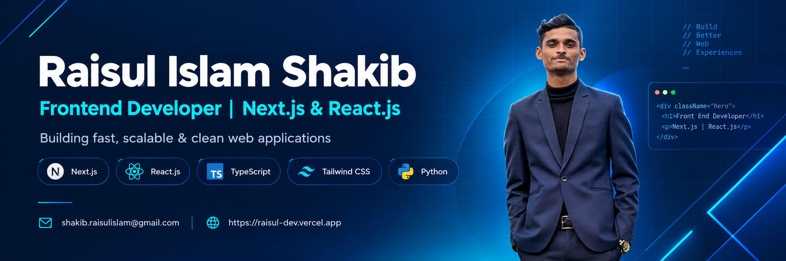

<!-- Banner Image (repo root-e banner.png naam e rakho) -->

 

<!-- Animated Typing Text -->

  

 

📍 **Location:** Cumilla, Bangladesh &nbsp;|&nbsp; 💼 **Open to:** Entry-level Frontend Developer roles

---

### 👨‍💻 About Me

* 🎓 Final-year **B.Sc. in Computer Science & Engineering** student at **Bangladesh University of Business and Technology (BUBT)**.
* 💻 **Frontend Developer** building responsive, accessible web interfaces with **React.js, TypeScript, JavaScript (ES6+) and Tailwind CSS**.
* 🔌 Comfortable with **REST API integration**, reusable component architecture, and clean **Git/GitHub** workflows.
* 🤖 Applied **AI/ML background** — a capstone on multimodal chest X-ray analysis plus ML & NLP coursework, which helps me build data-driven, model-backed UIs.
* ⚡ Improved rendering and layout performance in my web projects, **reducing page load time by ~20%** across devices.
* 🎯 **Goal:** Deliver clean, maintainable, high-performance UIs in a professional frontend team.

---

### 🔭 Current Focus

- 🧪 **Final Year Capstone** — *Multimodal Medical Report Understanding for Chest X-ray Disease Classification*: combining chest X-ray images with free-text radiology reports for multi-label thoracic disease classification.
- 📚 Reviewed **25 research papers** on vision–language fusion (ViT, ClinicalBERT, cross-attention, retrieval & report generation) across datasets like MIMIC-CXR, IU X-ray and CheXpert.
- ⚛️ Sharpening my **React + TypeScript** skills through real-world, deployed projects.

---

### 🛠️ Technical Skills

| Category | Technologies & Tools |
| :--- | :--- |
| **Frontend & Web** |       |
| **Programming & Core** |      |
| **AI / ML Exposure** |       |
| **Databases** |   |
| **Tools & Deployment** |       |

---

### 🚀 Featured Projects

| Project | Description | Tech |
| :--- | :--- | :--- |
| **Frontend Web Apps & Interactive Portfolio** | Responsive, reusable-component based web apps with consistent mobile & desktop layouts, deployed on Vercel. Optimized for ~20% faster page loads. | `React.js` `JavaScript` `Tailwind CSS` `Vercel` |
| **Multimodal Chest X-ray Classification** *(Capstone, 2025 – Present)* | Multimodal deep learning combining chest X-rays and radiology reports for multi-label thoracic disease classification. | `Python` `ViT` `ClinicalBERT` `Multimodal Learning` |

> 🔗 More on my [GitHub profile](https://github.com/Raisul-shakib-dev?tab=repositories).

---

### 🏆 Certifications & Training

- 🎓 **Advanced Learning Algorithms** — DeepLearning.AI & Stanford University (Coursera), Oct 2025
- 🎓 **Supervised Machine Learning: Regression and Classification** — DeepLearning.AI & Stanford University, Jul 2025
- 💼 **EY Technology Risk Virtual Job Simulation** — Forage, Jul 2026

---

### 🤝 Leadership & Activities

- 🏁 Volunteer — **ICPC Regional Contest** Organizing Team (2025)
- 🎭 Executive Member — **BUBT Cultural Club** (2024 – 2026)
- 💡 Active Technical Member — **BUBT IT Club** (2023 – 2026)

---

### 📊 GitHub Stats & Activity

  

---

### 📫 Let's Connect

I'm actively looking for an **entry-level Frontend Developer** opportunity. If you have a role, project, or idea — feel free to reach out via [LinkedIn](https://www.linkedin.com/in/raisul-shakib-dev) or [email](mailto:shakib.raisulislam@gmail.com).

---

💻 <i>"Crafting clean, responsive and high-performance interfaces — one component at a time."</i>

